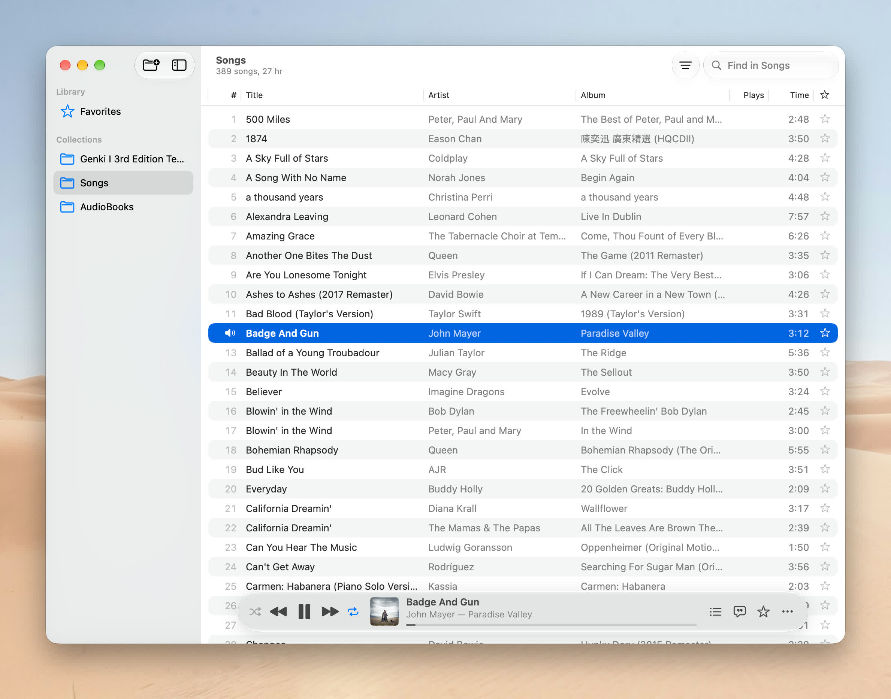
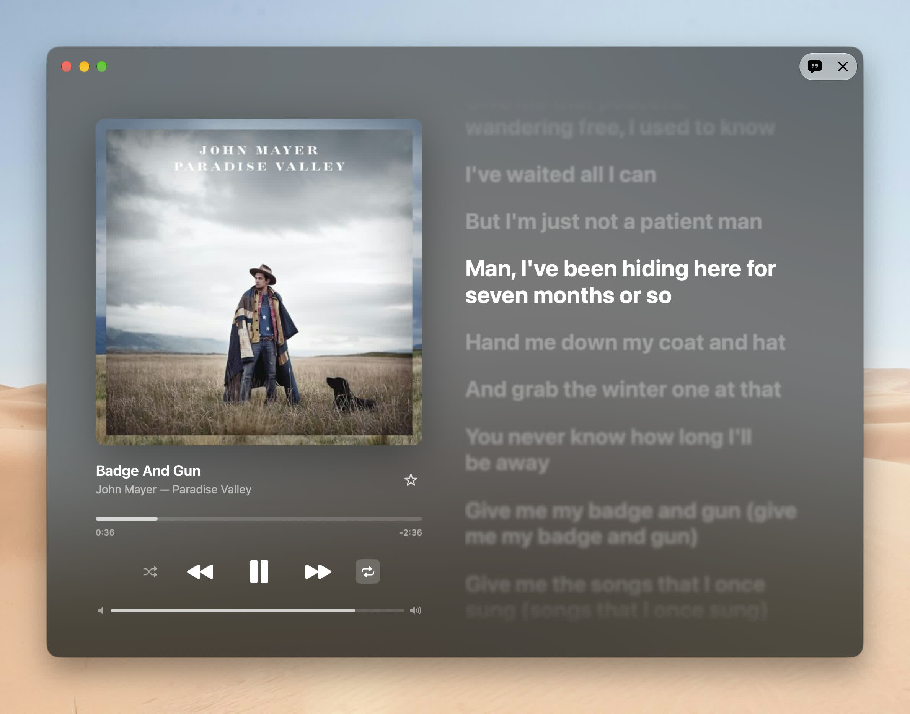

# Magpie

A native macOS 26+ audio player for your local library, written in SwiftUI + AVFoundation. A native rewrite of the Electron [Magpie](../magpie), modeled on Apple Music.




## Two modes

- **List mode**: collections in the sidebar and a song table. The toolbar holds transport controls, an Apple Music–style "LCD" (artwork, title, progress), a filter/sort menu (All Songs / Only Favorites, sort by any column) and "Find in Songs" search.
- **Player mode**: a full-window player with large artwork, synced lyrics (click a line to seek), and a backdrop tinted by the artwork.

Switch modes with ⇧⌘F, the toolbar button, or a click on the LCD artwork. Each mode keeps its own window size.

## Features

- Add folders as collections (⌘O or drag & drop). Folders are watched live with FSEvents: added, renamed, deleted and retagged files show up within about a second. ⌘R forces a full rescan.
- Reads title, artist, album, duration and artwork, falling back to `cover.jpg`/`folder.jpg` next to the files. Metadata is cached.
- Lyrics: a sidecar `.lrc` first, then [LRCLIB](https://lrclib.net). Lyrics are cached on disk.
- Audiobooks (`.m4b`/`.m4a` with embedded chapters) work like folders: double-click to open one (⌘[ to go back), and its chapters are plain tracks there, queued only with each other. A collection's own queue skips books. A book resumes in the chapter you left it; play counts belong to the whole book, while the book and each chapter are starred separately (starred chapters show up in Favorites).
- Favorites, play counts, shuffle, repeat (all/one).
- Reopens the last song where you left off. Long tracks (≥10 min) remember their position.
- Now Playing / Control Center integration and media keys.
- Shortcuts: Space play/pause · ⌘←/→ previous/next · ⇧⌘←/→ ±15s · ⌘↑/↓ volume · ⌘L favorite · ⌘U lyrics (in the player) · ⌘F search.

## Build

```bash
xcodegen generate
xcodebuild -project Magpie.xcodeproj -scheme Magpie -configuration Debug -derivedDataPath build build
open build/Build/Products/Debug/Magpie.app
```

## Releasing

Magpie updates itself with [Sparkle](https://sparkle-project.org) (Magpie → Check for Updates…, and automatically in Release builds). Its feed is the `appcast.xml` attached to the latest GitHub release.

```bash
scripts/release.sh 0.2.0 notes.md
```

This sets the version, commits it, tags `v0.2.0` (with the notes as its message) and pushes. The Release workflow then builds the app, signs it with the Developer ID, notarizes it, signs the zip for Sparkle, builds a signed and notarized DMG, writes `appcast.xml`, and publishes the GitHub release with all three. Without a notes file, the notes are the commit subjects since the last tag.

The workflow needs these repository secrets: `CSC_LINK` (the Developer ID Application certificate as a base64 `.p12`), `CSC_KEY_PASSWORD` (if the `.p12` has one), `APPLE_API_KEY` (an App Store Connect API key's `.p8` contents), `APPLE_API_KEY_ID`, `APPLE_API_ISSUER`, and `SPARKLE_PRIVATE_KEY` (from `generate_keys -x`).

`LOCAL=1 scripts/release.sh …` builds and publishes from your Mac instead, signing updates with the Sparkle key in your Keychain; set `DEVELOPER_ID` and the `APPLE_API_*` variables to sign and notarize too. `scripts/build-release.sh` alone builds into `dist/` without touching git or GitHub.

Formats: MP3, AAC/M4A/M4B, ALAC, FLAC, WAV, AIFF, CAF. OGG isn't supported by AVFoundation.
